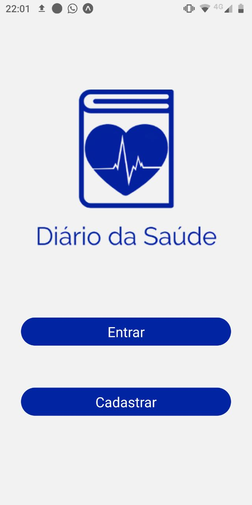
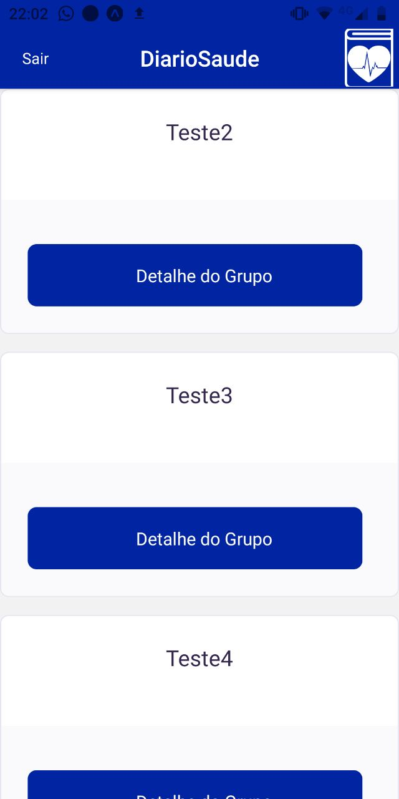
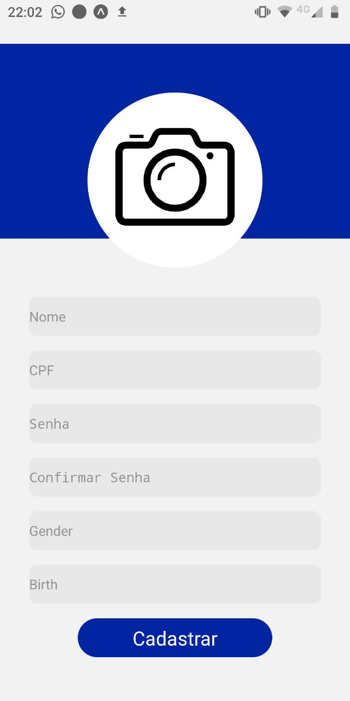
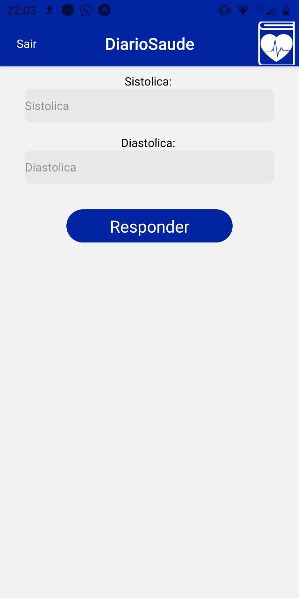

<p align="center">
    
</p>

# Diário da Saúde

**Número do Grupo**: 05<br>
**Código da Disciplina**: FGA0208-T01<br>

## Alunos
|Matrícula | Aluno |
| -- | -- |
| 16/0112028  |  André Goretti |
| 17/0103471  | Gabriel Marques Tiveron |
| 16/0007780  | Gustavo Barbosa Carvalho |
| 16/0124778 | Ian Pereira de Sousa Rocha |
| 17/0163571 | Murilo Loiola Dantas |
| 15/0064535 | Rodrigo Dadamos Lopes da Silva |

## Sobre 
O **Diário da Saúde** é uma aplicação que busca auxiliar Unidades Básicas de Saúde (UBS) que possuam grupos de risco (diabéticos, hipertensos, etc). A aplicação permite que os profissionais da unidade possam acompanhar a condição do paciente à distância, através de medições realizadas de casa pelo próprio paciente.

## Screenshots

Segue abaixo 3 exemplos de telas da aplicação desenvolvida. 

### Tela inicial


### Tela de cadastro


### Tela de listagem dos grupos


### Tela do questinário de pressão arterial



## Instalação 
**Linguagens**: JavaScript, TypeScript<br>
**Tecnologias**: NODE.js, React Native, Docker<br>
Com o Docker e o docker-compose instalados, execute os comandos

```bash
./setenv.sh
docker-compose up --build
```

## Uso 
No desenvolvimento, para executar a aplicação front, instale e abre o aplicativo Expo e aponte a câmera para o QR Code que apareceu no terminal.
Acesse o Mongo-Express em http://localhost:8081

## Vídeo
Adicione 1 ou mais vídeos com a execução do projeto final.

## Outros 
Quaisquer outras informações sobre seu projeto podem ser descritas abaixo.
