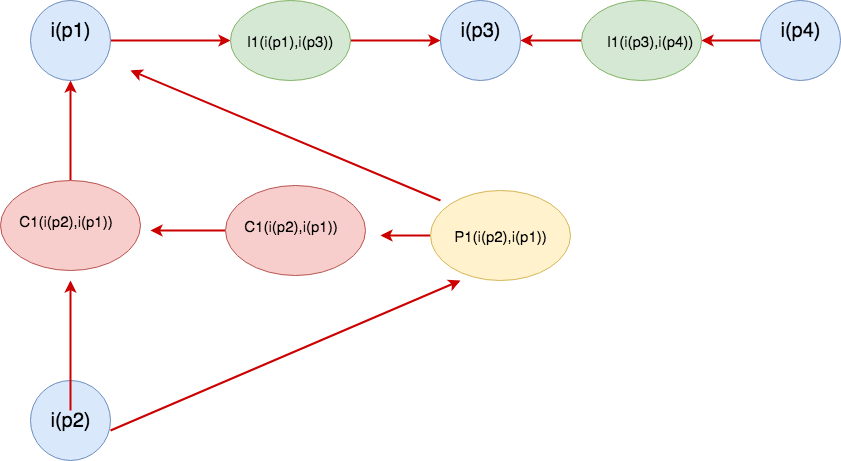

# Argumentação
## Versionamento
| Data | Versão | Descrição | Autor(es) |
|:----:|:------:|:---------:|:---------:|
| 09/09/2020 | 0.1 | Criação do Documento | [Rodrigo Dadamos](https://github.com/Rdadamos) |
| 09/09/2020 | 0.2 | Adição da argumentação sobre participar do grupo | [Rodrigo Dadamos](https://github.com/Rdadamos) |

## Definição

&emsp;&emsp;O modelo de argumentação do Framework ACE é uma ferramenta que oferece maneiras de modelar e pensar sobre os requisitos com o objetivo de verificar a validação dos artefatos da solução. O ACE disponibiliza uma vocabulário para representar as informações e decisões levantadas durante uma discussão. Para representar as informações extraidas, utiliza uma linguagem própria.

&emsp;&emsp;Basicamente, os modelos de argumentação são grafos que possuem direcionamentos com rótulos. Os rótulos são:

* <strong>i</strong> -  servem de entrada ou saída para inferências representando vértices de informação;
* <strong>I</strong> - representam a aplicação de inferências para obtenção de determinadas saídas;
* <strong>C</strong> - representam os conflito entre dois ou mais vértices;
* <strong>P</strong> - representam a preferência entre dois ou mais vértices.

## Argumentação
### Participar dos grupos de Acompanhamento
##### Autor: Rodrigo Dadamos

* i(p1): O paciente precisa ir na UBS participar da reunião do grupo de acompanhamento para medir e informar sua condição atual e receber orientações.

* i(p2): Devido a pandemia, doentes crônicos e grupos de riscos devem evitar sair de casa.

* i(p3): O risco de contrair COVID-19 afasta pacientes dos grupos de de acompanhamentos.

* i(p4): O paciente pode participar do grupo a distância enviando informações de sua condição atual e recebendo orientações também a distância.

## Referências

1. [https://bdm.unb.br/bitstream/10483/9267/1/2014_AndreCruzAlvesCavalcante.pdf](https://bdm.unb.br/bitstream/10483/9267/1/2014_AndreCruzAlvesCavalcante.pdf).
