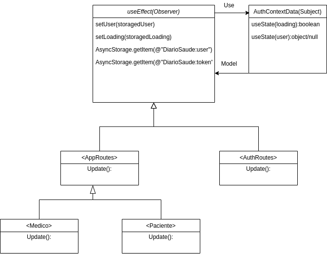

# GOF's Comportamentais

## Versionamento

|    Data    | Versão |                    Descrição                    |                                        Autor(es)                                         |
| :--------: | :----: | :---------------------------------------------: | :--------------------------------------------------------------------------------------: |
| 22/10/2020 |  0.1   |              Criação do Documento               |                      [Murilo Loiola](https://github.com/murilo-dan)                      |
| 26/10/2020 |  0.2   |              Adição da Introdução               |                        [Ian Rocha](https://github.com/IanPSRocha)                        |
| 26/10/2020 |  0.2   |            Adição do Template Method            |                        [Ian Rocha](https://github.com/IanPSRocha)                        |
| 26/10/2020 |  0.3   | Remoção do Template Method e adição do Observer | [Ian Rocha](https://github.com/IanPSRocha), [André Goretti](https://github.com/Agoretti) |
| 26/10/2020 |  0.4   |             Adicionando Hyperlinks              | [Ian Rocha](https://github.com/IanPSRocha), [André Goretti](https://github.com/Agoretti) |
| 26/10/2020 |  0.5   |          Adicionando Diagrama Observer          | [Ian Rocha](https://github.com/IanPSRocha), [André Goretti](https://github.com/Agoretti) |
| 26/10/2020 |  0.6   |            Adicionando Código Origem            | [Ian Rocha](https://github.com/IanPSRocha), [André Goretti](https://github.com/Agoretti) |

## Introdução

<p align="justify">&emsp;&emsp;Padrões de projeto comportamentais
auxiliam bastante quando é necessário utilizar vários algoritmos diferentes, cada um para algum contexto. Permitem, nesse caso, usar mecanismos/recursos para facilitar tanto a incorporação de novos algoritmos para novos contextos, quanto a seleção de qual algoritmo usar
dado um contexto. Auxiliam também alterando o tempo de execução que certo algoritmo tenha. Os principais GOF's comportamentais são:</p>

- Command;
- Iterator;
- Mediator;
- Observer;
- State;
- Strategy;
- Template Method;
- Visitor;
- Memento;
- Chain Of Responsability;

<p align="justify">&emsp;&emsp;A seguir, estão descritos somente os padrões aplicados no projeto, escolhidos pelo grupo quanto a contribuição que a aplicação do padrão traria para o desenvolvimento do projeto.</p>

## Observer

#### Definição

<p align="justify">&emsp;&emsp;O padrão Observer oferece um modelo no qual os objetos tem um evento e são notificados quando o evento ocorre. Esse padrão é a base da programação orientada a eventos, incluindo JavaScript. O padrão Observer facilita um bom design orientado a objetos e promove uma fácil integração. O paradigma de eventos e do manipulador de eventos em JavaScript é a manifestação do Observer.</p>

#### Aplicação no Projeto

<p align="justify">&emsp;&emsp;A aplicação Diário da Saúde é completamente feita em javascript, linguagem que mais se beneficia do padrão comportamental Observer. Precisamos mudar as views de acordo com o usuário estar ou não logado e, caso esteje logado, identificar qual usuário.</p>

#### Diagrama

[](./img/Observer.png)

#### Código

- [Observer - Subject](https://github.com/UnBArqDsw/2020.1_G5_Diario_da_Saude/blob/master/mobile/DiarioSaude/src/contexts/auth.tsx)

```tsx
import React, { createContext, useState, useEffect } from "react";
import * as auth from "../services/auth";
import AsyncStorage from "@react-native-community/async-storage";

interface AuthContextData {
  singed: boolean;
  user: object | null;
  loading: boolean;
  singIn(): Promise<void>;
  singOut(): void;
}

const AuthContext = createContext<AuthContextData>({} as AuthContextData);

export const AuthProvider: React.FC = ({ children }) => {
  const [user, setUser] = useState<object | null>(null);
  const [loading, setLoading] = useState(false);

  useEffect(() => {
    async function loadStorageData() {
      const storagedUser = await AsyncStorage.getItem("@DiarioSaude:user");
      const storagedToken = await AsyncStorage.getItem("@DiarioSaude:token");

      if (storagedUser && storagedToken) {
        setUser(JSON.parse(storagedUser));
        setLoading(false);
      }
    }

    loadStorageData();
  }, []);

  async function singIn() {
    const response = await auth.singIn();

    console.log(response);

    setUser(response.user);

    await AsyncStorage.setItem(
      "@DiarioSaude:user",
      JSON.stringify(response.user)
    );
    await AsyncStorage.setItem("@DiarioSaude:token", response.token);
  }

  function singOut() {
    AsyncStorage.clear().then(() => {
      setUser(null);
    });
  }

  return (
    <AuthContext.Provider
      value={{ singed: !!user, user, loading, singIn, singOut }}
    >
      {children}
    </AuthContext.Provider>
  );
};

export default AuthContext;
```
</br>

- [Observer - Controller](https://github.com/UnBArqDsw/2020.1_G5_Diario_da_Saude/blob/master/mobile/DiarioSaude/src/routes/index.tsx)

```tsx
import React, { useContext } from "react";
import { View, ActivityIndicator } from "react-native";

import AuthContext from "../contexts/auth";

import AppRoutes from "./app.routes";
import AuthRoutes from "./auth.routes";

const Routes: React.FC = () => {
  const { singed, loading } = useContext(AuthContext);

  if (loading) {
    return (
      <View style={{ flex: 1, justifyContent: "center", alignItems: "center" }}>
        <ActivityIndicator size="large" color="#666" />
      </View>
    );
  }

  return singed ? <AppRoutes /> : <AuthRoutes />;
};

export default Routes;
```

## Referências

* Observer - dofactory. Disponível em: <a>https://www.dofactory.com/javascript/design-patterns/observer</a>. Acesso em: 26 Outubro 2020.
* Observer Design Pattern. Disponível em: <a>https://sourcemaking.com/design_patterns/observer</a>. Acesso em: 26 Outubro 2020.
