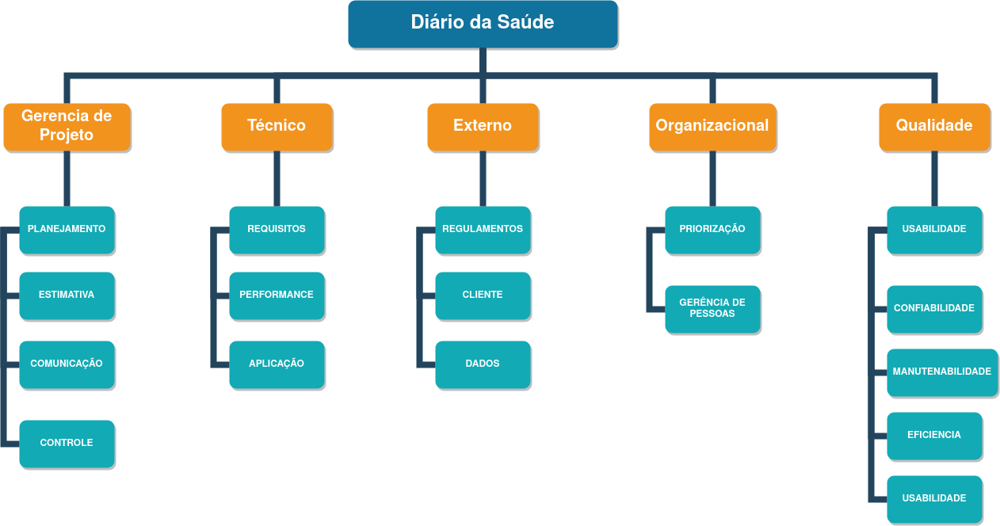
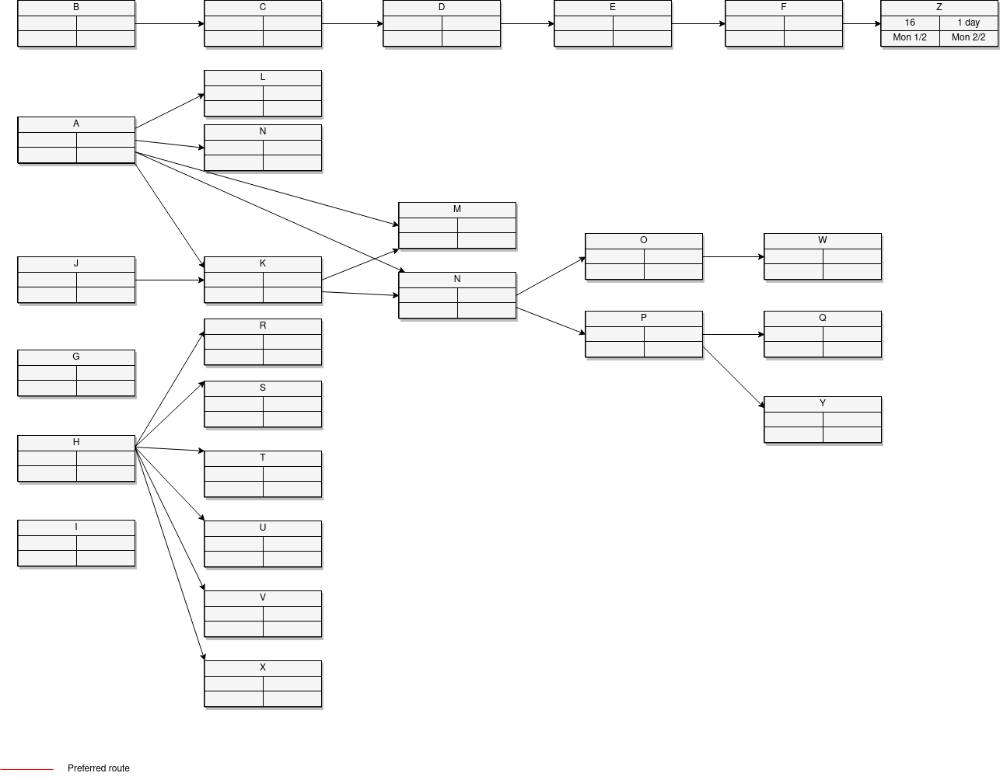

# Plano de Análise de Risco

## Versionamento
| Data | Versão | Descrição | Autor(es) |
|:----:|:------:|:---------:|:---------:|
| 03/08/2020 | 0.1 | Criação do Documento | [Gabriel Tiveron](https://github.com/GabrielTiveron) |
| 03/08/2020 | 0.2 | Padronização do documento | [Murilo Loiola](https://github.com/murilo-dan) |
| 09/09/2020 | 0.3 | Complementação nas descrições da EAR | [Gabriel Tiveron](https://github.com/GabrielTiveron)|
| 09/09/2020 | 0.4 | Atualização da imagem de EAR | [Gabriel Tiveron](https://github.com/GabrielTiveron)|
| 09/09/2020 | 0.5 | Adição nas matrizes de impacto |[Gabriel Tiveron](https://github.com/GabrielTiveron) |
| 10/09/2020 | 0.6 | Criação da Tabela do PERT/CPM |[Gabriel Tiveron](https://github.com/GabrielTiveron) |
| 11/09/2020 | 0.7 | Adição do diagrama PERT | [Gabriel Tiveron](https://github.com/GabrielTiveron) |

## Introdução

&emsp;&emsp;Este documento tem como objetivo explorar possíveis casos de risco para o projeto, bem como seu gerenciamento. O gerenciamento de risco está contido no gerenciamento do projeto e se baseia em prazos de entrega e nas ocasiões em que este pode ser afetado. Sendo assim, o documento tratará da identificação desses riscos, como serão identificados, ter a solução/prevenção priorizada.

## Estrutura Analítica de Riscos

### Descrição da Estrutura Analítica de Risco

#### **Gerência de Projeto**

* **Planejamento:** se baseia no cronograma para ter prazos de desenvolvimento e conclusão de tarefas, onde podem ocorrer imprevistos que atrasem o cronograma.

* **Estimativa:** também muito relacionada ao planejamento para tentar prever qual o período de execução de cada tarefa, muito importante para a confecção do PERT/CPM.

* **Comunicação:** estar a par com toda a equipe de desenvolvimento para ter sempre um acompanhamento do desenvolvimento. Falhas na comunicação podem trazer desmotivação dos membros resultando em queda de desempenho.

* **Controle:** controlar as atividades que estão sendo desenvolvidas e dividir o backlog de forma parelha. Um controle feito de forma errônea pode sobrecarregar algum membro fazendo com que os prazos não sejam cumpridos. 

#### **Técnico**

* **Requisitos:** levantamento de requisitos para que ao final do desenvolvimento o produto atenda as expectativas dos clientes e *stakeholders*.

* **Performance:** componente essencial para o projeto, pois visa atender clientes com possível carência tecnológica.

* **Aplicação:** o projeto desenvolvido deve se adequar ao propósito proposto.

#### **Externo**

* **Regulamento:** Deve seguir a regulamentação necessária para o porte de dados dos usuários.

* **Cliente:** usuários do produto podem ou não aprovar sua utilidade e eficiência.

* **Dados:** necessário o acesso à uma base de dados ou o desenvolvimento de uma caso não seja possível.

#### **Organizacional**

* **Priorização:** A priorização deve visar a entrega primeiramente daquilo que é necessário para o funcionamento do produto.

* **Dependências do projeto:** Visa o gerenciamento dos integrantes da equipe de desenvolvimento do projeto.

#### **Qualidade**

* **Usabilidade:** acesso as informações contidas devem ser intuitivas e fornecer feedbacks ao usuário.

* **Confiabilidade:** trazer segurança para os dados armazenados e manipulados.

* **Manutenabilidade:** Deve haver uma preocupação em manter uma padronização para melhor futura     manutenção do produto.

* **Eficiencia:** O produto deve atender as expectativas nas quais foi fundada sua ideia.

* **Usabilidade:** Deve ter uma boa interação e experiência com o usuário.

## Análise quantitativa dos riscos

&emsp;&emsp;Utilizando a matriz de probabilidade de ocorrência e impacto será feita uma análise para a priorização de prevenção de riscos. Dessa forma, tendo feito a priorização, poderá, então, ser feita uma visualização melhor de cada elemento de risco. As possíveis categorizações estão descritas abaixo:

####  **Probabilidade**
| Probabilidade  | Peso  |
|:--------------:|:-----:|
| Muito Baixa    | 1 |
| Baixa          | 2 |
| Média          | 3 |
| Alta           | 4 |
| Muito Alta     | 5 |

####  **Impacto**
|Impacto|Descrição|Peso|
|:-----:|:-------:|:--:|
|Muito Baixo|Praticamente não impacta o projeto|1|
|Baixo|Tem algum impacto sobre o projeto|2|
|Médio|Impacta de forma considerável, porém recuperável|3|
|Alto |Tem grande impacto sobre o projeto|4|
|Muito Alto|Interrompe o desenvolvimento/execução do projeto|5|

#### **Prioridade**

| P/I | Muito Baixo  | Baixo | Médio | Alto | Muito Alto |
| :-: | :----------: | :---: | :---: | :--: | :--------: |
| Muito Baixa |	1 | 2 | 3 | 4 | 5 |
| Baixa	| 2 | 4 | 6 | 8 | 10 |
| Média | 3 | 6 | 9 | 12 | 15 |
| Alta | 4 | 8 | 12 | 16 | 20 |
| Muito Alta | 5 | 10 | 15 | 20 | 25 |

## Matrizes de Impacto

#### **Riscos organizacionais**
| Risco | Impacto | Probabilidade | Prevenção | Resposta | Prioridade |
| :---: | :-----: | :-----------: | :-------: | :------: | :--------: |
|Falta de comprometimento ou desistência da disciplina por algum integrante da equipe|Muito Alto|Baixa|Reuniões informais|Realocação da carga de trabalho para os membros restantes|10|
|Priorização de atividades pouco relevantes|Alto|Baixa|Manter um bom planejamento|Reforçar o empenho nas tarefas mais necessárias|8|
|Falta de comunicação entre os membros da equipe|Muito Alto|Muito Baixa|Padronização dos meios de comunicação|Aumentar o engajamento entre os membros|5|

#### **Riscos técnicos**
| Risco | Impacto | Probabilidade | Prevenção | Resposta | Prioridade |
| :---: | :-----: | :-----------: | :-------: | :------: | :--------: |
|Dificuldade de identificar requisitos|Muito Alto|Baixa|Fazer uma boa elicitação de requisitos|Revisitar os artefatos de elicitação|10|
|Baixo domínio das tecnologias|Alto|Média|Estudar individualmente as tecnologias utilizadas|Pareamento entre pessoas com maior domínio|12|
|Atraso na conclusão das atividades|Alto|Média|Seguir o cronograma proposto cumprindo o backlog de cada sprint|Rever o planejamento do backlog para que seja alcançada a entrega prevista|12|

#### **Riscos Externos**
| Risco | Impacto | Probabilidade | Prevenção | Resposta | Prioridade |
| :---: | :-----: | :-----------: | :-------: | :------: | :--------: |
| Não conseguir atender as expectativas dos usuários| Alto| Baixa| Realizar questionários e validações das funcionalidades do projeto | Rever as formas de validação e verificar se requisitos elicitados foram realmente satisfeitos | 8 |
| Não assegurar os dados do usuário | Muito Alto| Baixa | Ter um banco de dados consistente para armazenar de forma segura os dados | Rever as requisições e armazenamento interno para previnir possíveis falhas de segurança | 10 |
| Dados da saúde do paciente serem acessiveis por terceiros | Alto | Baixo | Definir que apenas os responsáveis por cada grupo possam acessar tais informações | Rever a forma de como são manipuladas as informações em cada grupo | 8 |

#### **Gerência de Projeto**
| Risco | Impacto | Probabilidade | Prevenção | Resposta | Prioridade |
| :---: | :-----: | :-----------: | :-------: | :------: | :--------: |
| Erro no planejamento do sprint backlog | Alto | Baixa | Analisar a capacidade de desenvolvimento de cada integrante para não sobrecarregar e nem criar folgas desnecessárias | Revisar o planejamento e utilizar metodologias para melhoria do desempenho, como pareamento e XP | 8 |
| Falha na estimativa de entrega de funcionalidades | Alto | Média | Ter o conhecimento da experiência dos desenvolvedores com as tecnologias e frameworks que serão utilizadas | Recalcular as datas de entrega e aumento no empenho | 12 |

#### **Qualidade**
| Risco | Impacto | Probabilidade | Prevenção | Resposta | Prioridade |
| :---: | :-----: | :-----------: | :-------: | :------: | :--------: |
| Não manter uma padronização de código no projeto seguindo folha de estilo | Muito Alto | Muito  Baixa | Utilização de folhas de estilos para que sejam aceitas apenas contribuições de acordo com a folha de estilo | Refatorar todo o código que não está de acordo com o padrão do projeto | 5 |
| Não dar feedback das ações de usuário | Alto | Média | Verificar funcionalidades com análises de usuário | Refatorar tarefas feitas por usuários para melhorar sua experiência | 12 |

## Caminho Crítico com PERT/CPM

| Atividade | Descrição | Precedentes | Duração |
|:---------:|:---------:|:-----------:|:-------:|
| A | Configuração do ambiente de desenvolvimento | - | 1 |
| B | Diagrama BPMN | - | 1 |
| C | Modelos UML  | B | 2 |
| D | Padrões Emergentes | C | 1 |
| E | Padrões GoFs | D | 4 |
| F | Documento de Arquitetura | E | 3 |
| G | Documento de visão | - | 1 |
| H | Protótipo | - | 1 |
| I | Escolha das Frameworks | - | 1 |
| J | Modelagem do Banco de Dados | - | 1 |
| K | Conectar o Banco de Dados à aplicação | J, A | 1 |
| L | Criação da API Node | A | 2 |
| M | Coletar as informações de cadastro do usuário | A, K | 1 |
| N | Criação de papeis de usuário na aplicação | A, K | 1 |
| O | Criação de grupo entre usuários pacientes | N | 2 |
| P | Coletar informações frequentemente | N | 2 |
| Q | Criação de estatísticas para administradores do grupo| P | 2 |
| R | Tela de Login | H | 1 |
| S | Tela de coleta de informações | H | 2 |
| T | Tela de Grupos | H | 1 |
| U | Tela de Estatísticas | H, Q | 2 |
| V | Tela de FAQ | H | 1 |
| X | Menu lateral | H | 1 |
| W | Administradores poderem adicionar participantes para grupos | O | 1 |
| Y | Criar sistemas de notificação para lembrar os usuários | P | 2 |
| Z | Revisar Artefatos desenvolvidos | F | 1 |

## Diagrama PERT

